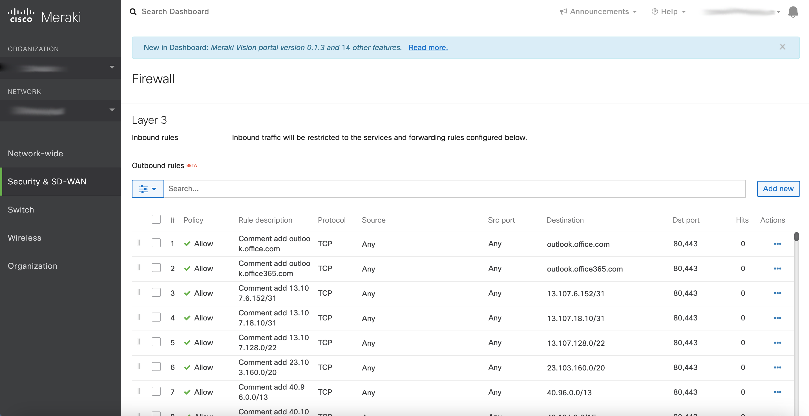

# Automation: Update the L3 firewall rules of an MX network (using Office 365 endpoints)


### Business challenge
- Make a solution that automatically updates Office 365 endpoints as Meraki L3 firewall rules




### Requirements
You can deploy app using [Python](https://www.python.org/downloads/)
or [Docker](https://www.docker.com/get-started)


### Clone and open project

```
git clone https://github.com/oborys/Meraki_Network_Objects_automation.git
cd Meraki_Network_Objects_automation
```

Open files `cred` and paste your variable `Meraki API Key` as `APIkey`, instructions [here](https://documentation.meraki.com/General_Administration/Other_Topics/Cisco_Meraki_Dashboard_API)

As a SourceSaaSLink predefined this source [https://endpoints.office.com/endpoints/worldwide?clientrequestid=b10c5ed1-bad1-445f-b386-b919946339a7](https://endpoints.office.com/endpoints/worldwide?clientrequestid=b10c5ed1-bad1-445f-b386-b919946339a7)

And `Organization ID` as `organizationId`, 
You can get your organization ID using [this](https://developer.cisco.com/meraki/api-v1/#!get-organizations) API operation, click Configuration paste and save your Meraki API Key in the related field. In response, you can find the organization you wish to configure and copy the ID.
Alternative method: Log in to the Meraki Dashboard (in the same browser)
Click on this URL: [https://dashboard.meraki.com/api/v1/organizations](https://dashboard.meraki.com/api/v1/organizations)


**Deploy using Python**

Run for testing and development without docker
Create the venv in webex_roullete folder

**For Windows:**

<details><summary>CLICK ME</summary>
<p>

Install pip

Pip (Python Package Installer), the official documentation for [pip](https://pip.pypa.io/en/stable/installation/).

Usually Python3 comes with pip preinstalled. If you get an error "pip command not found", use the following command to install pip:

Download [get-pip.py](https://pip.pypa.io/en/stable/installation/), make sure you're saving the file to Desktop

In your Command Prompt, navigate to Desktop.
```
cd Desktop
```
Execute get-pip.py
```
python get-pip.py
```
Now pip should work system-wide.

virtualenv

In your Command Prompt, enter:
```
pip install virtualenv
```
Launch virtualenv

In your Command Prompt navigate to your project:
```
cd Meraki_Network_Objects_automation
```
Within your project:
```
virtualenv env
```
Activate your virtualenv:

on Windows, virtualenv creates a batch file
```
\env\Scripts\activate.bat
```
to activate virtualenv on Windows, activate script is in the Scripts folder :

\path\to\env\Scripts\activate

Example:
```
C:\Users\'Username'\venv\Scripts\activate.bat
```
Another way to install pip

Save the "ez_setup.py" file to your desktop form https://bootstrap.pypa.io/ez_setup.py

In your Command Prompt navigate to Desktop:
```
cd Desktop
```
Execute ez_setup.py:
```
python ez_setup.py
```
install pip:
```
easy_install pip
```
Install dependencies
```
pip install -r requirements.txt
```
Run the app
```
set FLASK_APP=hello
flask run
```
</p>
</details>

```
python3 -m venv venv
```

Activate your venv

```
source venv/bin/activate
```

Install dependencies
```
pip install -r requirements.txt
```

```
export FLASK_APP=meraki_automation.py
```
Run the app
```
flask run
```
**Deploy using Docker**
```
docker-compose up
```

Ensure the app is running in the browser
[http://localhost:5000](http://localhost:5000) 

Bring down the containers:

```
docker-compose stop
```

### Rebuild containers

Get a list of running containers.
```
docker ps -a
```
Choose CONTAINER ID with name. 
```
meraki_network_objects_automation_app
```
then stop docker containers
```
docker stop [CONTAINER ID]
```
and delete it
```
docker rm [CONTAINER ID]
```
Make changes in code and then run. 
```
docker-compose up
```

Stop all running containers:
``` 
docker stop $(docker ps -a -q)
```
Delete all running containers:
```
docker rm $(docker ps -a -q)
```
Delete all untagged Docker images
```
docker rmi $(docker images | grep '^' | awk '{print $3}')
```

# Cisco Meraki Network Objects automation

The solution can help pull the actual IP list of SaaS providers into your Cisco Meraki network.

You can automate object creation. The solution will be delivered in next release

**Network Objects/Groups can be applied to:**

- Individual and Template Networks: Layer 3 Inbound, Layer 3 

- Outbound, and Failover Cellular Firewall Rules.

Organization-wide Site to Site VPN Outbound Firewall Rules

Security & SD-WAN > Firewall > Add new


For scheduling Python code to be executed with some period, we use [APScheduler](https://pypi.org/project/APScheduler/)


Some wildcard DNS records from Microsoft list problems with add domain names like *-admin.sharepoint.com or autodiscover.*.onmicrosoft.com or *cdn.onenote.net


Sample of Body response in case of an error 
```
{
    "errors": [
        "At least one of your firewall rules is invalid: \"network[firewall_rules][1][dst_cidr] Destination address must be an IP address or a subnet in CIDR form (e.g. '192.168.1.0/24'), a comma-separated list of addresses or subnets, a domain name (e.g. mail.foo.com or foo.com), or 'any'\"."
    ]
}
```

Similar solution
https://github.com/SalnikovAndrey/performance-based-routing-to-office-365-over-meraki-sd-wan/blob/master/o365_sd_wan.py


## Useful links

- [Network Objects Configuration Guide](https://documentation.meraki.com/MX/Firewall_and_Traffic_Shaping/Network_Objects_Configuration_Guide)

- [Office 365 URLs and IP address ranges](https://docs.microsoft.com/en-us/microsoft-365/enterprise/urls-and-ip-address-ranges?view=o365-worldwide)

- [Cisco Meraki dashboard API](https://developer.cisco.com/meraki/api-v1/#!introduction/meraki-dashboard-api)

- [Postman collaction: Cisco Meraki dashboard API](https://www.postman.com/meraki-api/workspace/cisco-meraki-s-public-workspace/collection/897512-42355ad3-0145-48c6-8e65-e4bb9f180939?ctx=documentation)
